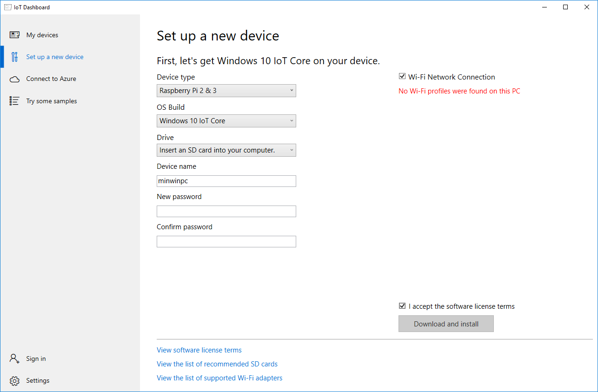
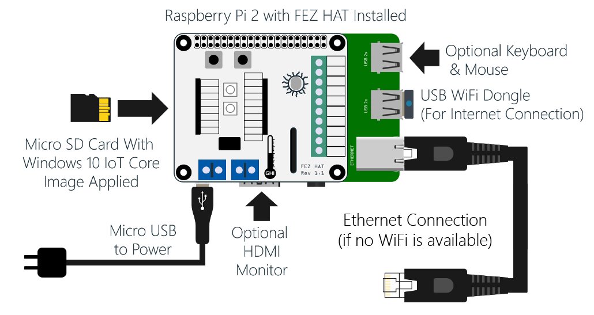
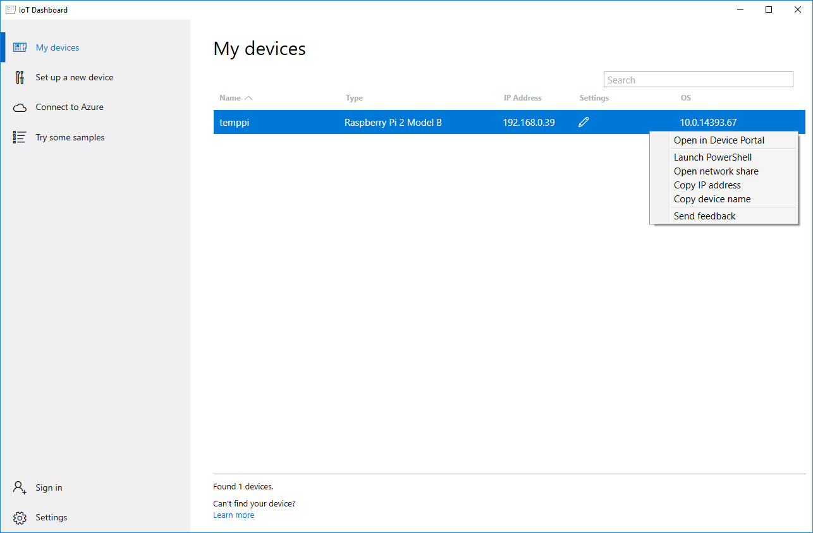

# Setting up
Coming soon...

## 1. Setting up your devlopment environment
To work with Windows 10 IoT core from a developer's perspective, you need a bunch of tools and helpers installed on your machine. Follow the instructions below to get your device ready for development. As we are creating Universal Windows apps in this lab, make sure to select the *Universal Windows App Development Tools* when installing Visual Studio 2015

> **Hint:** As the installation of Visual Studio 2015 can take some time, you can already proceed with the following steps while installing

1. Install any version of [Visual Studio 2015](https://www.visualstudio.com/products/visual-studio-community-vs) with Update 3 and Universal Windows App Development Tools.
2. Install the [Windows IoT Core Project Templates](https://visualstudiogallery.msdn.microsoft.com/55b357e1-a533-43ad-82a5-a88ac4b01dec) to extend Visual Studio with IoT project templates.
3. Make sure you’ve [enabled Windows 10 developer mode](https://msdn.microsoft.com/windows/uwp/get-started/enable-your-device-for-development)
4. Install the [Windows IoT Core Dashboard](https://developer.microsoft.com/en-us/windows/iot/downloads) to manage your devices.

## 2. Install Windows IoT Core on your MicroSD card
Due the Raspberry Pi has now own storage beside the MicroSD card, the opertating system can only be installed there. This has the advantage that you are able to hot swap opertaing systems and different evironments on your Pi by simply replacing the card.

To provision a MicroSD card with Windows IoT core, you can simply insert the card into your card reader and open the Windows 10 IoT Core Dashboard app. Navigate to ***Set up a new device*** and fill out the form.

If your Raspberry Pi has a Wi-Fi connection (Raspberry Pi 3 or connected with [one of these](https://developer.microsoft.com/en-us/windows/iot/Docs/HardwareCompatList.htm#WiFi-Dongles)), you can directly set it up here, if your PC also has a Wi-Fi module. If you do so, the device automatically connects to the selected network as soon as it gets booted for the first time.

> **Hint:** You can only select those Wi-Fi networks, your host has been connected to at some time. To connect your Raspberry Pi to a network that is not listet, connect your host PC to it first.

If you are satisfied with the settings, hit ***Download and install*** and let the tool do the rest.

## 3. Setting up the Raspberry Pi

Once the MicroSD card is ready and Windows 10 IoT Core has been sucessfully installed, you are ready to set up the device.

1. Insert the MicroSD card
2. Connect to network via Ethernet or Wi-Fi (if available)
3. Mount the FET Hat to the GPIO ports as seen in the image above
4. Connect to external display with HDMI (optional)
5. Last, connect MicroUSB cable for power

Once the Raspberry gets a power connection, it starts the booting process automatically. Especially at the first time, this can taka a couple of minutes. If your Pi is connected to a display, you can follow the booting process. Otherwise just wait some minutes. If your Raspberry is connected to the same network as your computer, it should show up at the *My devices* section of the IoT Dashboard as soon it is available.

## 4. Connect with your Raspberry Pi

## 5. Deploy your first app

