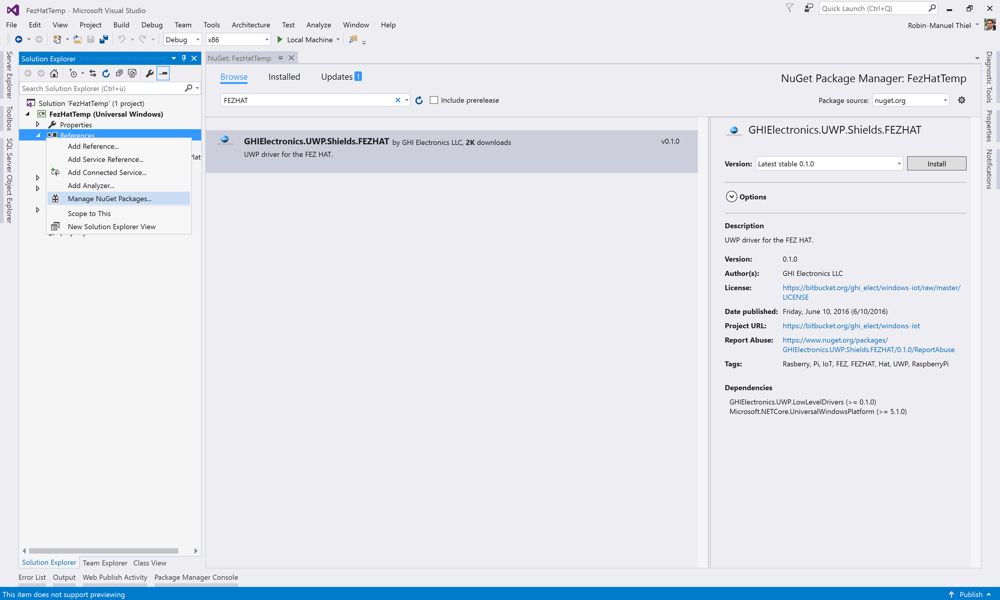

# Receiving real values
You are ready to create your first real world application. In this module we will use the FET Hat to read temperature values from your Raspberry Pi to be ready to precess and send them to the cloud in the next modue.

## 1. Create the project
Again, we need a new UWP application first. As learned in [05 Setting up](05%20Setting%20up#5-deploy-your-first-app), open Visual Studio 2015 and select ***File*** -> ***New*** -> ***Project...*** to open the new project dialog. Navigate through the installed project templates and find the ***Blank App (Universal Windows)*** at the ***Visual C#*** -> ***Windows*** -> ***Universal*** folder. After naming your project, click on ***OK*** to get started with the empty project.


## 2. Add necessary 3rd party libraries
As the [GHI FEZ Hat](https://www.ghielectronics.com/catalog/product/500) is from a third-party vendor, its functionality and bits are not included into Windows 10 IoT Core be default, of course. Fortunately, GHI provides an [official library](https://www.nuget.org/packages/GHIElectronics.UWP.Shields.FEZHAT/) for working with the FEZ Hat on Windows via NuGet. NuGet is a package management system that comes with Visual Studio and is very popular in the .NET community.

To add this library to your project via NuGet, rightclick on the ***References*** folder of your project in Visual Studio and select ***Manage NuGet Packages...*** to open the NuGet package manager for your project.

Head over to the ***Browse*** tab and search for "`FEZHat`". The `GHIElectronics.UWP.Shields.FEZHAT` package should appear in the results list. Select the package and hit the ***Install*** button on the right to add it to the project.



> **Hint:** If you know the excact name of a package, like we do from the [NuGet webiste](https://www.nuget.org/packages/GHIElectronics.UWP.Shields.FEZHAT/), you could also open the Package Manager Console in Visual Studio and simply type this to add the package via console:
```
PM> Install-Package GHIElectronics.UWP.Shields.FEZHAT
```

## 3. Prepare the code
